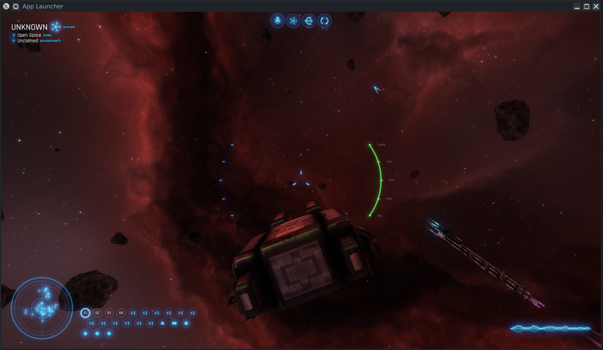

<!--
Copyright (C) 2025  darkoned12000
SPDX-License-Identifier: GPL-3.0-or-later
Part of the ltheory-old-test modernization effort (Revamp Work).
See NOTICE and LICENSE.GPL. Original engine (c) Josh Parnell, public domain.
-->

# Limit Theory Old

This is the (old) C++ implementation of Limit Theory, the Limit Theory Engine (LTE), and the Limit Theory Scripting Language (LTSL), written from 2012 to 2015. While this code is dated compared to the newer C/Lua LT, it is arguably meatier in gameplay implementation.

This fork (`ltheory-old-test`) focuses primarily on **Linux** support, building and running on modern GCC 15 / CMake 4.

---

# Requirements

Although LT was developed for both Windows and Linux (indeed, primarily developed on Linux), the Windows build was the one historically resurrected first. **Linux is now fully supported** in this fork (`ltheory-old-test`) — see the Linux section below.

# Prerequisites

To build Limit Theory, you'll need a few standard developer tools. All of them are available to download for free.

- Python 3: https://www.python.org/downloads/
- Git: https://git-scm.com/downloads
- Git LFS: https://git-lfs.github.com/
- A C++17 compiler (GCC or Clang)
- CMake >= 3.10: https://cmake.org/download/

> **Note on Git LFS**: The original repo used Git LFS for large resources. This
> fork currently ships resources as plain files (no `.gitattributes`), so
> `git lfs install` is optional here — but if you re-enable LFS upstream, run it
> before cloning.

---

# Building on Linux

Limit Theory builds and runs on modern Linux (tested with GCC 15 / CMake 4).

> **Wayland / X11:** the engine uses **SFML 2.6.2**, which has an **X11-only**
> backend. On a Wayland session it runs transparently through **XWayland** (most
> distros enable this by default), so no extra setup is needed. If you are on a
> pure-Wayland session without XWayland, launch under XWayland or an X11 session.
> A known harmless quirk: on some Wayland+XWayland setups, pressing **ESC** can
> leave the **CapsLock LED** stuck on — just tap CapsLock to clear it; it is a
> compositor artifact, not an engine bug.

## Dependencies

Install the following packages (Debian/Ubuntu):

```
sudo apt update
sudo apt install git-lfs \
                 build-essential cmake \
                 libopenal-dev \
                 libvorbis-dev libogg-dev \
                 libflac-dev flac libflac++-dev \
                 libglew-dev \
                 libfreetype6-dev \
                 libx11-dev libxrandr-dev libxinerama-dev libxcursor-dev libxi-dev
```

- **Git LFS** — optional for this fork, but recommended if LFS is reintroduced.
- **OpenAL / Vorbis / FLAC / Ogg** — required by SFML's audio module.
- **GLEW** — OpenGL extension loading.
- **FreeType** — font rasterization (system FreeType is used; the old bundled
  copy in `extbin/linux64` was removed because it shadowed the system lib).

## Checking out the Repository

```
git lfs install        # optional for this fork
git clone https://github.com/darkoned12000/ltheory-old-test.git
cd ltheory-old-test
```

## Compiling

```
python3 configure.py            # generate build files (CMake)
python3 configure.py build      # compile (parallel, ~10s on fast hardware)
```

This produces `bin/launch` (the launcher) and `bin/liblt.so` (the engine).

## Running an LTSL App

`bin/launch` launches an LTSL script by name. Top-level apps live in
`resource/script/App/`. For example:

```
python3 configure.py run war
```

Example:


runs `resource/script/App/war.lts`, an AI skirmish test. The `war` app runs
on Linux with working mouse UI — pressing Escape opens the menu, and EXIT GAME
works. Many other apps are broken or incomplete, but several work well enough to
fly around a system. Other apps to try: `dogfight`, `launcher`, `threads`,
`colony`, `hnn`, `ui`, `platemesh`, `hud`, `objectinfo`, `map`, `market`.

**`ltheory-main`** is the recommended starting point for exploring the engine:
a seed-driven 3D universe sandbox (`python3 configure.py run ltheory-main`).
It generates a star + nebula + a planet with a seeded asteroid belt, spawns the
player ship among the rocks, and exposes a DevTool (**F2**) and a live scene
inspector (**F3**). Tweak the system via `resource/script/gameConfig.txt`
(`seed`, `loadTime`, `playerCredits`, `shipHull`).

> The `run` helper sets `LD_LIBRARY_PATH` so the bundled FMOD runtime
> libraries in `extbin/linux64` and `bin` are found automatically.

---

# Building on Windows (original instructions, untested in this fork)

With the above prerequisites installed, open a **Git Bash terminal**.

## Checking out the Repository

First, use `cd` to change directories to the place where you want to download LT.
- `cd ~/Desktop/<path where you want to put the LT source>`

Before doing any other `git` commands, make sure LFS is installed:
- `git lfs install`

You should see `Git LFS initialized` or a similar message. **Important**: if you forget to install and initialize Git LFS, most of the resources will probably be broken, and the whole process will likely fail in strange and mysterious ways. This is a common gotcha with projects that use LFS. Make sure you do the above step!

Now, you can download the repository:

- `git clone --recursive https://github.com/JoshParnell/ltheory-old.git ltheory-old`

## Compiling

From a terminal in the directory of the checked-out repository, run

- `python configure.py`

This runs CMake to generate the build files. Then, to compile,

- `python configure.py build`

This invokes compilation. It will take a while.

## Running an LTSL App

If the compilation is successful, you now have `bin/launch.exe`, which is the main executable. This program launches an LTSL script. The intention was for Limit Theory (and all mods) to be broken into many LTSL scripts, which would then implement the gameplay, using script functions exposed by the underlying engine.

To launch an LTSL script, you can again use the python helper:

- `python configure.py run <script_name_without_extension>`

All top-level scripts are in the `resource/script/App` directory. So you can do, for example:

- `python configure.py run war`

To run the app 'war.lts', which is an AI skirmish test. Many of the apps are broken or incomplete, but some work enough to allow you to fly around in a system.

# Example of the Entire Process

An example of the entire sequence of commands to run an LTSL app, starting from nothing (but having the prerequisites installed):

Open Git Bash. Each line below is one command, some of which will take a while to complete:

```
cd ~/Desktop
git lfs install
git clone --recursive https://github.com/JoshParnell/ltheory-old.git ltheory-old
cd ltheory-old
python configure.py
python configure.py build
python configure.py run war
```

---

# Architecture Overview

- **`src/liblt/`** — the engine library (LTE). Subsystems: `LTE` (core, type
  system, serializer, LTSL scripting), `Game`, `Component`, `UI`, `Module`
  (SoundEngine/FMOD, Physics, Scheduler), `Audio`, `Volume`.
- **`src/launch/`** — the `launch` executable entry point (`main()`).
- **`ext/SFML/`** — vendored SFML 2.6.2 (X11-only backend; runs on Wayland via
  XWayland), built statically into `liblt.so`.
- **`extbin/`** — shipped runtime binaries (FMOD).
- **`resource/`** — game data: 169 `.jsl` shaders, textures, fonts, LTSL scripts.
- **`script/`** — Python tooling (`tloc`, `assetlist`, ...).


---

# Current Controls
| Key         | Action                                     |
| ----------- | ------------------------------------------ |
| Mouse       | Camera rotation (when <space> is active)   |
| W / S       | Thrust Forward / Backward                  |
| A / D       | Strafe Left / Right                        |
| Q / E       | Roll Ship Left / Right                     |
| Tab         | Engine Boost                               |
| Right Mouse | Fire Weapons                               |
| Space       | Toggle camera controls                     |
| + / -       | Toggle camera location                     |
| H (hold)    | Time Skip (20x spped)                      |
| B           | Toggle HUD lock                            |
| F3          | Show debug info                            |
| F4          | Toggle HUD visibility                      |


See `AGENTS.md` for a detailed technical reference and the modernization
roadmap (library upgrades, build improvements, LTSL notes).
